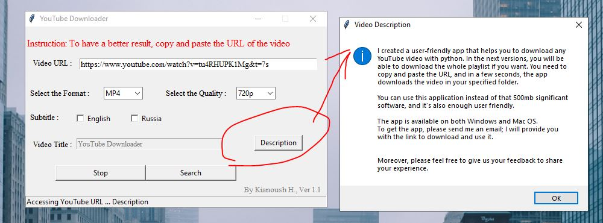

# YouTube Downloder Ver 1.1
This is the seccond version of the user-friendly YouTube-Downloder that helps you to download any YouTube video. I created this project in python. 

To work with this app you need to copy and paste the URL, and in a few seconds, the app downloads the video in your specified folder.

You can choose the subtitle language, quality of the video and format before the app downloads the video. Furthermore, you can see the video description before downloading.

You can use this application instead of that 500mb significant software, and it's also enough user friendly.

The app is available on both Windows and Mac OS.
To get the app, please send me an email; I will provide you with the link to download and use it.

Moreover, please feel free to give us your feedback to share your experience.

Email: haratiank2@gmail.com

YouTube channel: https://www.youtube.com/channel/UCvf9_53f6n3YjNEA4NxAkJA?view_as=subscriber
GitHub: https://github.com/Kianoush-h
LinkedIn: https://www.linkedin.com/in/kianoush-haratiannejadi/

## Install

### Dependencies

You need dependencies below.

- python3
- tkinter
- platform
- pytube


### Install repo and requirements

Clone the repo and install 3rd-party libraries.

```bash
$ git clone https://github.com/Kianoush-h/YouTube-Downloder
$ cd YouTube-Downloder
$ pip3 install -r requirements.txt
```


## Demo

### Test Inference

You can test the the app with this:

```
$ python3 YouTube_Downloader_Ver1.1.py
```


Then you will see the screen as below :


You need to copy and paste the URL, and in a few seconds, the app downloads the video in your specified folder.


Furthermore, you can see the video description before downloading.



## Future

In the next versions, you will be able to download the whole playlist if you want.


Moreover, please feel free to give us your feedback to share your experience.


# Contact Me

Email: haratiank2@gmail.com

YouTube channel: https://www.youtube.com/channel/UCvf9_53f6n3YjNEA4NxAkJA?view_as=subscriber
GitHub: https://github.com/Kianoush-h
LinkedIn: https://www.linkedin.com/in/kianoush-haratiannejadi/

